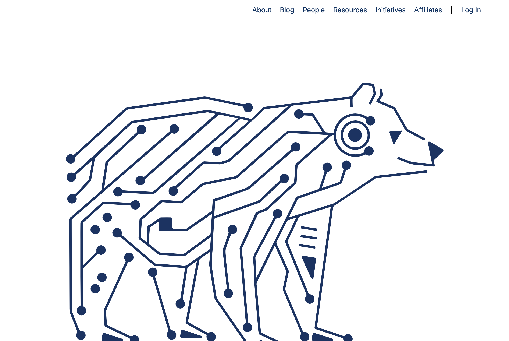
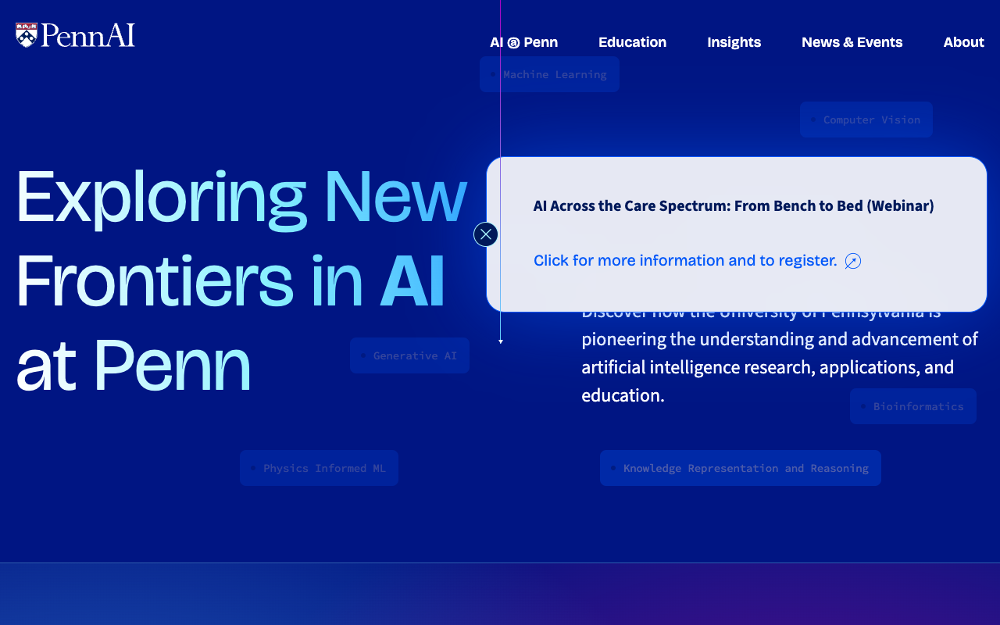
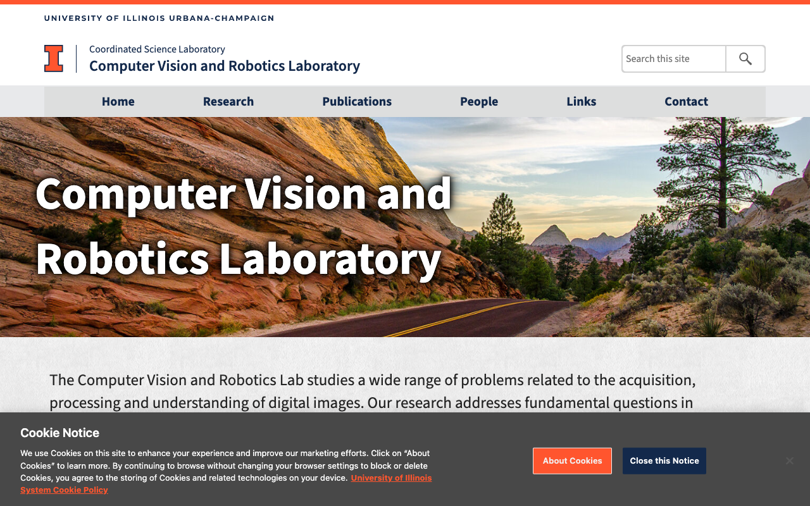
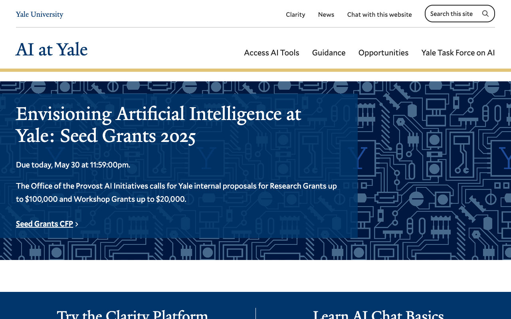
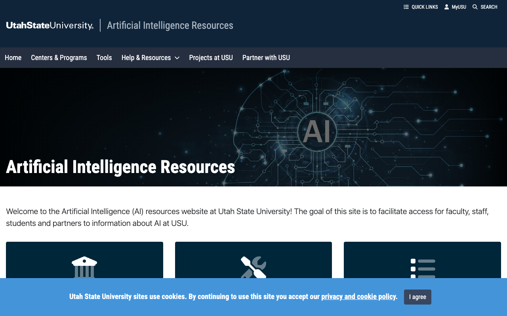
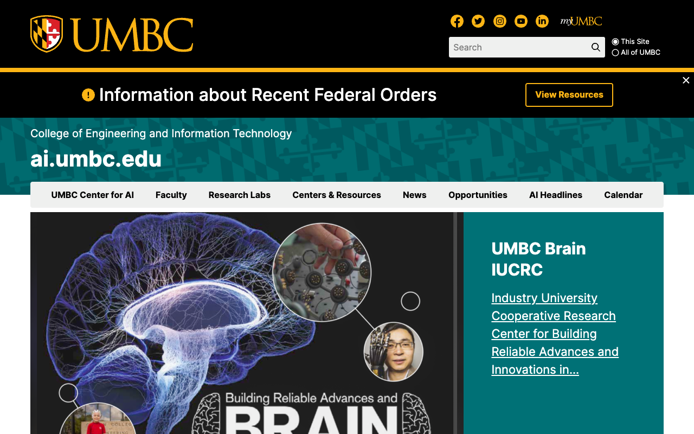
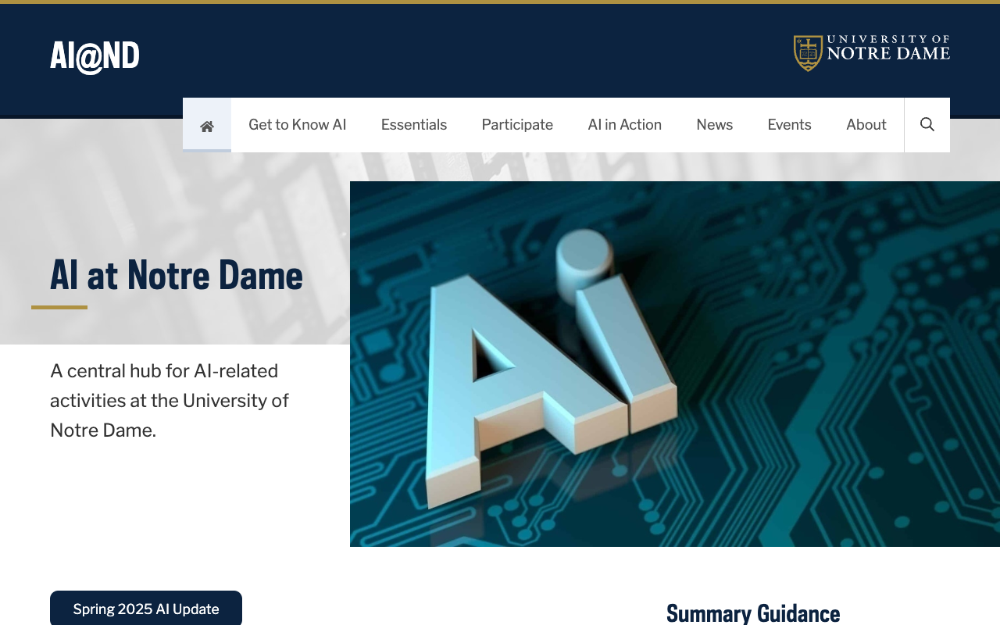
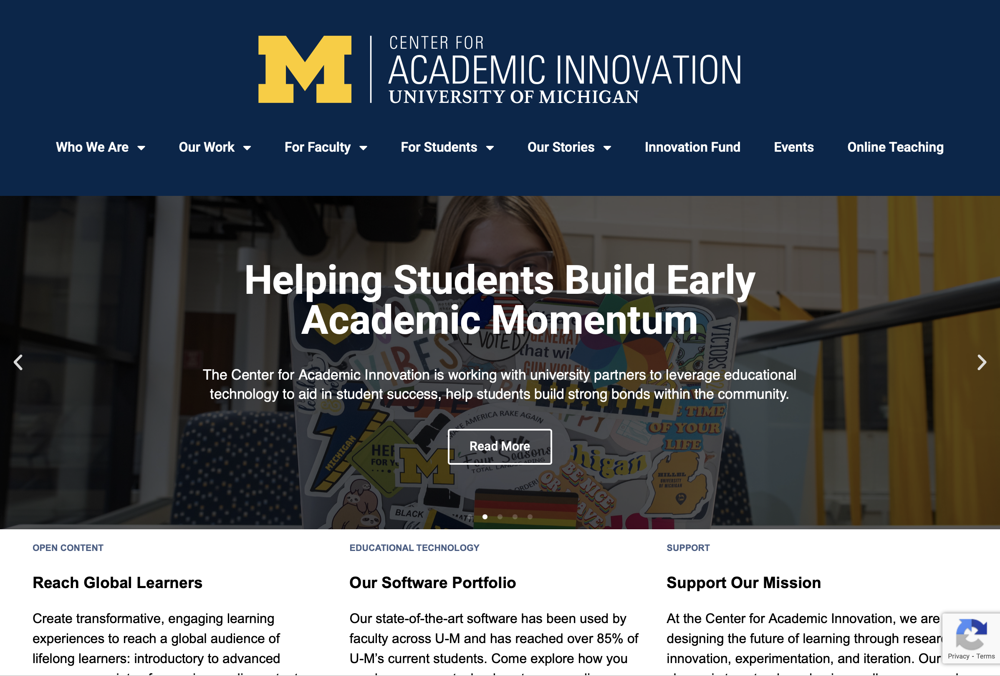

# AI Website Owners/Managers with Screenshots and Focus Areas

This file lists some of the AI-related university websites grouped by their primary focus area as of June 2025.

## Core Machine Learning & Deep Learning

| URL | Screenshot | Owner/Manager | Notes | Secondary Focus |
|-----|------------|---------------|-------|----------------|
| https://ai.cmu.edu |  | Carnegie Mellon AI Initiative; Computing Services; University Communications | Academic initiative with computing services and communications support | Vision & Robotics |
| https://ai.stanford.edu |  | Stanford Artificial Intelligence Laboratory (SAIL); Computer Science Department; Stanford Communications | Academic lab with department and communications support | Vision & Human-Centered AI |
| https://ai.utoronto.ca |  | University of Toronto AI Initiative; Faculty of Arts & Science; Department of Computer Science; central IT services | Academic leadership with faculty and IT support | NLP |
| https://ai.berkeley.edu |  | Berkeley Artificial Intelligence Research Lab (BAIR); Information Technology; Office of Strategic Communication | Academic lab with IT and strategic communications support | Applications & Vision |
| https://bair.berkeley.edu |  | Berkeley Artificial Intelligence Research Lab (BAIR); Information Technology; Office of Strategic Communication | Academic lab with IT and strategic communications support | Vision & Robotics |
| https://ai.northwestern.edu |  | Northwestern AI Initiative; Information Technology; University Communications | Academic initiative with IT and communications support | Data Science |

## Computer Vision & Robotics

| URL | Screenshot | Owner/Manager | Notes | Secondary Focus |
|-----|------------|---------------|-------|----------------|
| https://ai.princeton.edu |  | Princeton AI Initiative; Information Technology; University Communications | Academic initiative with IT and communications collaboration | Core ML |
| https://ai.cornell.edu |  | Cornell AI Initiative; Information Technology; University Communications | Academic initiative with IT and communications collaboration | Applications |
| https://ai.gatech.edu |  | Georgia Tech AI Initiative; Office of Information Technology; Institute Communications | Academic initiative with IT and communications support | Robotics |
| https://ai.duke.edu |  | Duke AI Initiative; Office of Information Technology (OIT); Duke Communications | Academic initiative with IT and communications collaboration | Core ML |
| https://ai.upenn.edu |  | UPenn AI Initiative; Information Technology; University Communications | Academic initiative with IT and communications collaboration | Robotics |
| https://vision.ai.illinois.edu |  | Computer Vision Group, Department of Computer Science; University of Illinois System IT; University Communications | Academic department with system IT and communications support | Core Vision Research |

## Natural Language Processing & Data Science

| URL | Screenshot | Owner/Manager | Notes | Secondary Focus |
|-----|------------|---------------|-------|----------------|
| https://ai.yale.edu |  | Office of the Provost AI Initiatives; IT Associate Director for Accessibility and AI Platform Services (Michael Vaughn); Yale IT; Yale College IT/Web Operations team | Multi-departmental collaboration between academic leadership and IT services | Ethics |
| https://ai.illinois.edu |  | University of Illinois AI Initiative; University of Illinois System IT; University Communications | Academic initiative with system IT and communications support | Core ML |
| https://ai.unc.edu |  | UNC AI Initiative; Office of Information Technology; UNC Communications and Public Affairs | Academic initiative supported by central IT and communications teams | Health Informatics |
| https://ai.ufl.edu |  | University of Florida AI Initiative; UF Information Technology; University Communications | Academic initiative with IT and communications support | Applications |
| https://ai.asu.edu |  | ASU AI Initiative; University Technology Office (UTO); ASU Enterprise Technology | University-wide AI initiative with technology office support | Human-AI Interaction |
| https://ai.osu.edu |  | Office of Technology and Digital Innovation (OTDI); AI research community; University Communications | Managed by OTDI with research community and communications support | Data Mining |

## AI Applications & Interdisciplinary Focus

| URL | Screenshot | Owner/Manager | Notes | Secondary Focus |
|-----|------------|---------------|-------|----------------|
| https://ai.psu.edu |  | Penn State AI Initiative; Information Technology Services (ITS); Strategic Communications | Academic initiative with central IT and communications support | Data Science |
| https://ai.uta.edu |  | President's AI Council (Chair: CIO Deepika Chalemela); President's AI Task Force; Center for Artificial Intelligence and Big Data (CARIDA), College of Engineering; Information Resources | Strategic leadership by AI Council and Task Force with academic and IT collaboration | Data Science |
| https://ai.jhu.edu |  | Johns Hopkins AI Initiative; Information Technology; Communications and Public Affairs | Academic initiative with IT and communications collaboration | Medical AI |
| https://ai.usc.edu |  | USC AI Initiative; Information Technology Services (ITS); University Communications | Academic initiative with IT and communications collaboration | Human-AI Interaction |
| https://ai.uic.edu |  | UIC AI Advisory Group; Information Technology; Office of Strategic Marketing and Communications | Advisory group governance with IT and communications support | Data Science |
| https://www.usu.edu/ai/ |  | Utah State University AI Initiative; Information Technology; University Communications | Academic initiative with IT and communications collaboration | Agriculture |
| https://ai.appstate.edu |  | App State AI Initiative; Information Technology; University Communications | Academic initiative with IT and communications collaboration | Education |
| https://ai.dartmouth.edu |  | Dartmouth AI Initiative; Information Technology; University Communications | Academic initiative with IT and communications collaboration | Cognitive Science |
| https://ai.uga.edu |  | UGA AI Initiative; Information Technology; University Communications | Academic initiative with IT and communications collaboration | Agriculture |
| https://ai.umbc.edu |  | UMBC AI Initiative; Information Technology; University Communications | Academic initiative with IT and communications collaboration | Cybersecurity |
| https://ai.umaine.edu |  | University of Maine AI Initiative; Information Technologies; University Communications | Academic initiative with IT and communications support | Environment |
| https://ai.utah.edu |  | AI Leadership Team led by Chief AI Officer (Manish Parashar); University Information Technology (UIT) Web Support & Usability; One-U Responsible AI Initiative | Strategic leadership by Chief AI Officer with IT and academic support | Visualization |

## AI Theory & Ethics

| URL | Screenshot | Owner/Manager | Notes | Secondary Focus |
|-----|------------|---------------|-------|----------------|
| https://ai.nd.edu |  | AI Enablement Team, Office of Information Technology, University of Notre Dame; AI Innovation Council; Notre Dame Web Team | Collaboration across IT, academic, and web teams | Applications |

## Academic Innovation

| URL | Screenshot | Owner/Manager | Notes | Secondary Focus |
|-----|------------|---------------|-------|----------------|
| https://ai.emory.edu |  | Emory AI.Humanity Initiative; Emory IT; Office of Communications and Marketing | Academic initiative with IT and communications support | - |
| https://ai.umich.edu |  | University of Michigan AI Initiative; Information and Technology Services (ITS); University Communications | Academic initiative with central IT and communications support | - |

